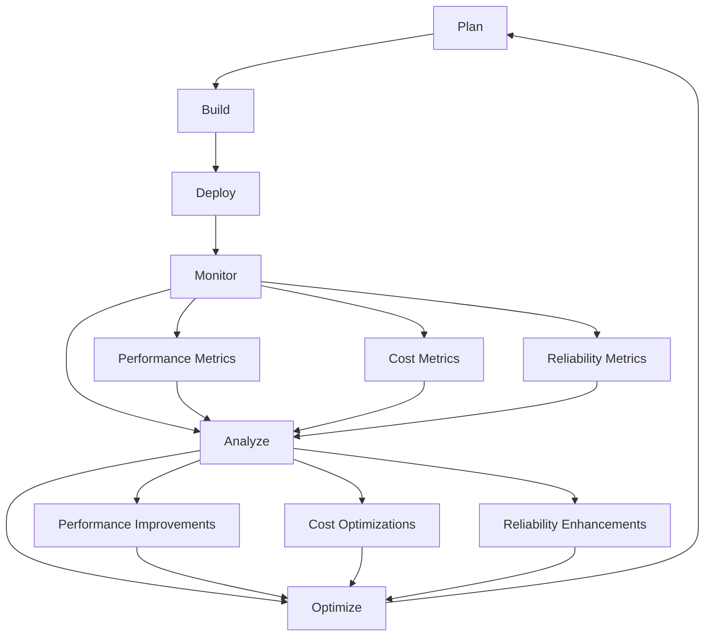

The convergence of DevOps and FinOps represents a fundamental shift from "just ship it" to "ship it smart." This evolution acknowledges that in cloud-native environments, how you build and deploy software directly impacts both operational efficiency and financial sustainability.

## From Speed to Sustainable Velocity

Traditional DevOps focused primarily on delivery speed and reliability. FinOps adds the missing dimension of cost efficiency, creating a more complete optimization framework.

### The Evolution of Engineering Metrics

DevOps teams typically optimize for:

- Deployment frequency
- Lead time for changes
- Mean time to recovery
- Change failure rate

FinOps-enabled DevOps teams add:

- Cost per deployment
- Resource efficiency ratios
- Cost per user/transaction
- Waste reduction metrics

This expanded metric set doesn't slow teams down - it helps them make better trade-off decisions and avoid technical debt that manifests as cost inefficiency.

### Sustainable Scaling Patterns

Consider how FinOps principles enhance traditional DevOps practices:

```python
# Traditional DevOps: Focus on functionality and performance
# FinOps-Enhanced DevOps: Add cost awareness to all decisions

class SmartDeploymentStrategy:
    def __init__(self):
        self.performance_targets = {
            'response_time_p95': 200,  # milliseconds
            'throughput_rps': 1000,    # requests per second
            'availability': 99.9       # percentage
        }

        # FinOps enhancement: Add cost constraints
        self.cost_constraints = {
            'max_cost_per_user': 0.10,    # dollars per month
            'max_infrastructure_cost': 5000,  # dollars per month
            'target_utilization': 70      # percentage
        }

    def select_deployment_configuration(self, expected_load):
        """Select optimal configuration balancing performance and cost"""

        configurations = [
            {
                'name': 'cost_optimized',
                'instances': self.calculate_minimum_instances(expected_load),
                'instance_type': 't3.medium',
                'estimated_cost': 450,
                'performance_score': 85
            },
            {
                'name': 'balanced',
                'instances': self.calculate_balanced_instances(expected_load),
                'instance_type': 'm5.large',
                'estimated_cost': 650,
                'performance_score': 95
            },
            {
                'name': 'performance_optimized',
                'instances': self.calculate_performance_instances(expected_load),
                'instance_type': 'm5.xlarge',
                'estimated_cost': 1200,
                'performance_score': 99
            }
        ]

        # FinOps decision framework: Choose based on cost-performance ratio
        best_config = self.optimize_cost_performance_ratio(configurations, expected_load)

        return best_config

    def optimize_cost_performance_ratio(self, configurations, expected_load):
        """Find the configuration with the best cost-performance ratio"""

        scored_configs = []

        for config in configurations:
            # Calculate cost per unit of performance
            cost_efficiency = config['performance_score'] / config['estimated_cost']

            # Check if it meets cost constraints
            cost_per_user = config['estimated_cost'] / expected_load
            meets_constraints = cost_per_user <= self.cost_constraints['max_cost_per_user']

            scored_configs.append({
                **config,
                'cost_efficiency': cost_efficiency,
                'meets_constraints': meets_constraints,
                'cost_per_user': cost_per_user
            })

        # Filter to only configurations that meet constraints
        valid_configs = [c for c in scored_configs if c['meets_constraints']]

        if not valid_configs:
            print("Warning: No configuration meets cost constraints!")
            return scored_configs[0]  # Return cheapest as fallback

        # Return the most cost-efficient valid configuration
        return max(valid_configs, key=lambda x: x['cost_efficiency'])

    def calculate_minimum_instances(self, expected_load):
        """Calculate minimum instances needed for the load"""
        # Simplified calculation - replace with actual capacity planning
        return max(2, expected_load // 500)

    def calculate_balanced_instances(self, expected_load):
        """Calculate balanced instance count with buffer"""
        return max(2, int(expected_load // 400 * 1.25))

    def calculate_performance_instances(self, expected_load):
        """Calculate instances for optimal performance"""
        return max(3, int(expected_load // 300 * 1.5))

# Example usage
strategy = SmartDeploymentStrategy()
optimal_config = strategy.select_deployment_configuration(expected_load=1000)

print(f"Selected configuration: {optimal_config['name']}")
print(f"Cost efficiency score: {optimal_config['cost_efficiency']:.3f}")
print(f"Monthly cost: ${optimal_config['estimated_cost']}")
print(f"Cost per user: ${optimal_config['cost_per_user']:.3f}")
```

## Integrated Optimization Workflows

FinOps and DevOps share common principles that create natural integration points.

### Continuous Improvement Cycles

Both practices emphasize continuous improvement through measurement and iteration:



### Automation and Infrastructure as Code

FinOps enhances Infrastructure as Code with cost awareness:

```terraform
# Enhanced Terraform module with cost optimization built-in
# terraform/modules/cost-aware-web-app/main.tf

variable "environment" {
  description = "Environment name (dev, staging, prod)"
  type        = string
}

variable "expected_users" {
  description = "Expected number of daily active users"
  type        = number
}

variable "cost_budget" {
  description = "Monthly cost budget in USD"
  type        = number
}

# Cost-aware configuration based on environment and budget
locals {
  environment_configs = {
    dev = {
      instance_type     = "t3.small"
      min_size         = 1
      max_size         = 2
      enable_spot      = true
      storage_type     = "gp3"
      multi_az         = false
    }
    staging = {
      instance_type     = "t3.medium"
      min_size         = 1
      max_size         = 3
      enable_spot      = true
      storage_type     = "gp3"
      multi_az         = false
    }
    prod = {
      instance_type     = "m5.large"
      min_size         = 2
      max_size         = 10
      enable_spot      = false
      storage_type     = "gp3"
      multi_az         = true
    }
  }

  config = local.environment_configs[var.environment]

  # Calculate if we need to adjust for budget constraints
  estimated_monthly_cost = local.config.min_size * 730 * 0.096  # Rough calculation
  needs_cost_optimization = local.estimated_monthly_cost > var.cost_budget

  # Adjust configuration if over budget
  final_config = local.needs_cost_optimization ? {
    instance_type = var.environment == "prod" ? "t3.large" : "t3.small"
    min_size     = 1
    max_size     = local.config.max_size
    enable_spot  = var.environment != "prod" ? true : local.config.enable_spot
    storage_type = "gp3"
    multi_az     = var.environment == "prod" ? true : false
  } : local.config
}

# Auto Scaling Group with cost-optimized configuration
resource "aws_autoscaling_group" "web" {
  name                = "${var.environment}-web-asg"
  vpc_zone_identifier = var.subnet_ids
  target_group_arns   = [aws_lb_target_group.web.arn]
  health_check_type   = "ELB"

  min_size         = local.final_config.min_size
  max_size         = local.final_config.max_size
  desired_capacity = local.final_config.min_size

  # Use mixed instances policy for cost optimization
  mixed_instances_policy {
    launch_template {
      launch_template_specification {
        launch_template_id = aws_launch_template.web.id
        version           = "$Latest"
      }

      # Cost optimization: Use multiple instance types
      override {
        instance_type = local.final_config.instance_type
      }

      # Add spot instances for non-production
      dynamic "override" {
        for_each = local.final_config.enable_spot ? [1] : []
        content {
          instance_type = local.final_config.instance_type
          spot_max_price = "0.05"  # Set maximum spot price
        }
      }
    }

    instances_distribution {
      on_demand_base_capacity                  = var.environment == "prod" ? 1 : 0
      on_demand_percentage_above_base_capacity = var.environment == "prod" ? 50 : 0
      spot_allocation_strategy                 = "diversified"
    }
  }

  # Enhanced tagging for cost attribution
  tag {
    key                 = "Name"
    value               = "${var.environment}-web-server"
    propagate_at_launch = true
  }

  tag {
    key                 = "Environment"
    value               = var.environment
    propagate_at_launch = true
  }

  tag {
    key                 = "CostCenter"
    value               = "engineering"
    propagate_at_launch = true
  }

  tag {
    key                 = "ExpectedUsers"
    value               = var.expected_users
    propagate_at_launch = true
  }

  tag {
    key                 = "CostBudget"
    value               = var.cost_budget
    propagate_at_launch = true
  }
}

# Cost monitoring and alerting
resource "aws_cloudwatch_metric_alarm" "cost_budget_alarm" {
  alarm_name          = "${var.environment}-cost-budget-alarm"
  comparison_operator = "GreaterThanThreshold"
  evaluation_periods  = "1"
  metric_name         = "EstimatedCharges"
  namespace           = "AWS/Billing"
  period              = "86400"
  statistic           = "Maximum"
  threshold           = var.cost_budget * 0.8  # Alert at 80% of budget
  alarm_description   = "Cost approaching budget limit"

  dimensions = {
    Currency = "USD"
  }

  alarm_actions = [aws_sns_topic.cost_alerts.arn]
}

# Output cost estimation for transparency
output "estimated_monthly_cost" {
  description = "Estimated monthly cost for this configuration"
  value = {
    base_cost = local.estimated_monthly_cost
    optimized = local.needs_cost_optimization
    final_estimate = local.needs_cost_optimization ? local.estimated_monthly_cost * 0.7 : local.estimated_monthly_cost
  }
}
```

## Organizational Transformation

The integration of FinOps and DevOps drives broader organizational changes that benefit both engineering productivity and business sustainability.

### Breaking Down Silos

Traditional organizations often separate concerns:

- Engineering focuses on features and performance
- Operations handles infrastructure and reliability
- Finance manages budgets and cost control

FinOps-enabled DevOps creates shared responsibility:

```python
# Example: Shared responsibility matrix for cloud resources

class SharedResponsibilityModel:
    def __init__(self):
        self.responsibilities = {
            'cost_budgeting': {
                'primary': 'finance',
                'secondary': ['engineering_leads', 'devops'],
                'informed': ['individual_engineers']
            },
            'cost_monitoring': {
                'primary': 'devops',
                'secondary': ['finance', 'engineering_leads'],
                'informed': ['individual_engineers']
            },
            'resource_optimization': {
                'primary': 'individual_engineers',
                'secondary': ['devops', 'engineering_leads'],
                'informed': ['finance']
            },
            'cost_allocation': {
                'primary': 'devops',
                'secondary': ['finance'],
                'informed': ['engineering_leads', 'individual_engineers']
            },
            'budget_variance_analysis': {
                'primary': 'finance',
                'secondary': ['engineering_leads'],
                'informed': ['devops', 'individual_engineers']
            }
        }

    def get_responsibility_for_role(self, role):
        """Get all responsibilities for a specific role"""
        role_responsibilities = {
            'primary': [],
            'secondary': [],
            'informed': []
        }

        for responsibility, owners in self.responsibilities.items():
            if owners['primary'] == role:
                role_responsibilities['primary'].append(responsibility)
            elif role in owners['secondary']:
                role_responsibilities['secondary'].append(responsibility)
            elif role in owners['informed']:
                role_responsibilities['informed'].append(responsibility)

        return role_responsibilities

    def print_role_responsibilities(self, role):
        """Print formatted responsibilities for a role"""
        responsibilities = self.get_responsibility_for_role(role)

        print(f"\n📋 RESPONSIBILITIES FOR: {role.upper().replace('_', ' ')}")
        print("=" * 50)

        if responsibilities['primary']:
            print("🎯 PRIMARY RESPONSIBILITIES:")
            for resp in responsibilities['primary']:
                print(f"   • {resp.replace('_', ' ').title()}")

        if responsibilities['secondary']:
            print("\n🤝 SUPPORTING RESPONSIBILITIES:")
            for resp in responsibilities['secondary']:
                print(f"   • {resp.replace('_', ' ').title()}")

        if responsibilities['informed']:
            print("\n📢 STAY INFORMED ABOUT:")
            for resp in responsibilities['informed']:
                print(f"   • {resp.replace('_', ' ').title()}")

# Example usage
model = SharedResponsibilityModel()

# Show responsibilities for different roles
for role in ['individual_engineers', 'devops', 'engineering_leads', 'finance']:
    model.print_role_responsibilities(role)
```

### Knowledge Sharing and Learning

Create learning paths that build both DevOps and FinOps capabilities:

```markdown
# DevOps + FinOps Learning Path

## Foundation Level (Month 1-2)

### DevOps Engineers

- [ ] Understanding cloud billing models
- [ ] Basic cost attribution with tagging
- [ ] Using cloud cost management consoles
- [ ] Implementing cost alerts and budgets

### Finance Teams

- [ ] Understanding cloud infrastructure basics
- [ ] DevOps workflow fundamentals
- [ ] Cloud resource lifecycle management
- [ ] Engineering productivity metrics

## Intermediate Level (Month 3-4)

### Cross-Functional Skills

- [ ] Cost optimization techniques
- [ ] Infrastructure as Code for cost management
- [ ] Implementing cost-aware CI/CD pipelines
- [ ] Advanced cost allocation strategies

## Advanced Level (Month 5-6)

### Specialized Focus

- [ ] Building cost optimization into architecture design
- [ ] Advanced automation for cost management
- [ ] Cultural change management for cost awareness
- [ ] Strategic cost planning and forecasting

## Ongoing Development

### Quarterly Objectives

- [ ] Cross-team cost optimization projects
- [ ] Innovation challenges combining efficiency and performance
- [ ] Knowledge sharing sessions between teams
- [ ] Continuous improvement of FinOps processes
```

## Looking Forward: The Future of Smart Delivery

The integration of FinOps and DevOps is just the beginning. Several trends will shape how teams ship software smartly:

### AI-Powered Optimization

Machine learning will increasingly automate cost optimization decisions:

- Predictive scaling based on usage patterns and costs
- Automated resource right-sizing recommendations
- Intelligent workload placement across cloud regions and providers

### Sustainability Integration

Environmental considerations will join cost and performance as key optimization criteria:

- Carbon-aware deployment strategies
- Energy-efficient infrastructure choices
- Sustainable software architecture patterns

### Value-Based Engineering

Teams will optimize for business value delivery rather than just technical metrics:

- Feature ROI tracking integrated with deployment pipelines
- Customer value metrics driving infrastructure decisions
- Business outcome optimization spanning the entire software lifecycle

## Practical Next Steps

To start your FinOps journey or enhance existing practices:

### Week 1: Assessment and Foundation

1. **Audit current cost visibility**: Can you attribute costs to teams and projects?
2. **Identify top cost drivers**: What services account for 80% of your cloud spend?
3. **Assess team awareness**: Do engineers know the cost impact of their decisions?

### Week 2-4: Quick Wins

1. **Implement basic tagging**: Ensure all resources have cost attribution tags
2. **Set up cost alerts**: Create budget notifications for major cost centers
3. **Find obvious waste**: Identify and eliminate unused resources

### Month 2-3: Integration

1. **Add cost gates to CI/CD**: Implement cost estimation in deployment pipelines
2. **Create cost dashboards**: Build engineer-friendly cost visibility tools
3. **Start optimization cycles**: Regular reviews and improvements

### Month 4-6: Cultural Change

1. **Gamify optimization**: Create friendly competition around cost efficiency
2. **Integrate with planning**: Include cost considerations in architecture reviews
3. **Measure and celebrate**: Track both cost savings and delivery improvements

### Ongoing: Continuous Evolution

1. **Advanced automation**: Implement sophisticated cost optimization tools
2. **Cross-team collaboration**: Build stronger engineering-finance partnerships
3. **Innovation focus**: Use cost efficiency gains to fund new capabilities

## Conclusion: Shipping Smart as Competitive Advantage

The convergence of DevOps and FinOps isn't just about reducing cloud bills - it's about building sustainable competitive advantage through intelligent resource utilization. Teams that ship smart can:

- Deliver more features within the same budget
- Scale efficiently without cost surprises
- Respond quickly to market changes without financial risk
- Innovate continuously with reinvested savings

The transition from "just ship it" to "ship it smart" represents a maturation of engineering practices. It acknowledges that in cloud-native environments, every engineering decision has financial implications, and optimal solutions balance performance, reliability, and cost.

Success requires both technical implementation and cultural change. The tools and practices in this guide provide the foundation, but lasting transformation comes from teams that embrace cost efficiency as a core engineering value.

Start small, measure impact, and build momentum. The intersection of DevOps speed and FinOps intelligence creates opportunities for engineering teams to deliver exceptional value to their organizations and customers.

The future belongs to teams that don't just move fast - they move smart.
